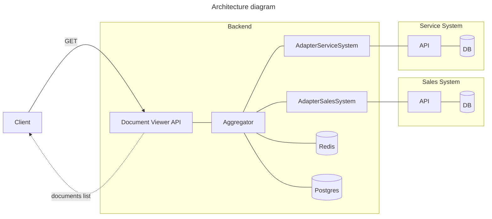
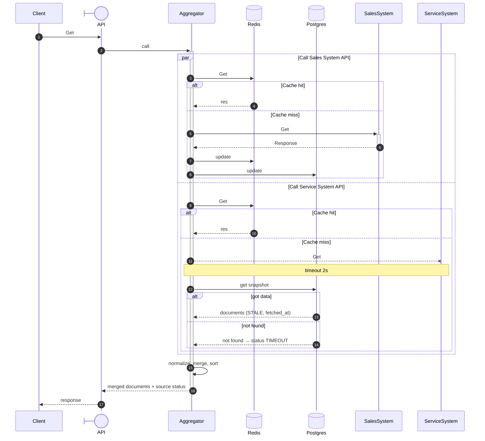

## Architecture diagram

```mermaid
---
title: Architecture diagram
---
flowchart LR
    Client -->|GET| API[Document Viewer API]
    API -.->|documents list| Client
    
    subgraph Backend
	    
		  API --- Agg[Aggregator]		 
		  Agg --- A1[AdapterSalesSystem] 
		  Agg --- A2[AdapterServiceSystem] 
		  Agg --- Cache[(Redis)]
		  Agg --- DB[(Postgres)]
		 
	  end
		  
	  subgraph ext1 [Sales System]
		  EA1[API]
			EA1 --- DB1[(DB)]
	  end
	  
	  subgraph ext2 [Service System]
		  EA2[API]
			EA2 --- DB2[(DB)]
	  end
	  
    A1 --- EA1
    A2 --- EA2
```

## Sequence diagram

```mermaid
---
config:
  sequence:
    messageMargin: 60
---
sequenceDiagram
    autonumber
    participant C as Client
    participant A@{ "type": "boundary", "alias": "API" }
    participant Agg as Aggregator
    participant Redis@{"type":"database"}
    participant DB@{"type":"database", "alias":"Postgres"}
    participant Ex1 as SalesSystem
    participant Ex2 as ServiceSystem
    C->>A: Get
    A->>+Agg: call
    par Call Sales System API 
        Agg->>Redis: Get
        alt Cache hit
          Redis-->>Agg: res
        else Cache miss
          Agg->>+Ex1: Get
          Ex1-->> Agg: Response
          deactivate Ex1
          Agg->>Redis: update
          Agg->>DB: update
        end
        
        
    and Call Service System API
				Agg->>Redis: Get
        alt Cache hit
          Redis-->>Agg: res
        else Cache miss
          Agg--xEx2: Get
          Note over Agg,Ex2: timeout 2s
          Agg->>DB: get snapshot
          alt got data
	          DB-->>Agg: documents (STALE, fetched_at)
          else not found
	          DB-->>Agg: not found → status TIMEOUT
          end
                    
        end
    end


		Agg->>Agg: normalize, merge, sort
    Agg-->>-A: merged documents + source status
    A-->>C: response
```
